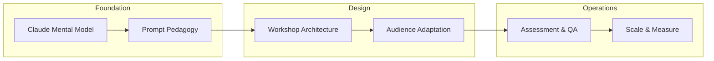

# Course Description

## Claude Train-the-Trainer: Enabling AI Champions at Scale

---

## Overview

This training system prepares experienced facilitators and subject matter experts to design, deliver, and scale Claude training programs across diverse organizational contexts. Participants learn not just *how* Claude works, but how to *teach others* to use it effectively — with structured methodologies for workshop design, audience adaptation, quality assurance, and outcome measurement.

The program addresses the critical gap between Claude product knowledge and the pedagogical skills required to transfer that knowledge at scale. A trainer who understands Claude deeply but cannot adapt their delivery for different audiences will fail. A facilitator with strong teaching skills but shallow Claude knowledge will mislead learners. This system builds both capabilities simultaneously.

## Target Audience

| Audience | Role Context | Key Needs |
|----------|-------------|-----------|
| Enterprise Training Teams | L&D professionals in organizations deploying Claude | Structured curricula, scalable workshop designs, executive reporting |
| Partner Champions | Consultants and channel partners delivering Claude training | Client-ready materials, audience adaptation frameworks, credibility tools |
| Internal Enablement Leaders | Department leads driving Claude adoption | Quick-start modules, peer training techniques, adoption metrics |
| Instructional Designers | Curriculum architects building Claude programs | Learning objective design, assessment blueprints, content sequencing |

## Prerequisites

- **Basic Claude fluency** — Comfortable using Claude for common tasks (writing, analysis, coding, summarization)
- **Training program design experience** — Understanding of learning objectives, session planning, and facilitation fundamentals
- **Organizational context awareness** — Familiarity with the audience(s) you intend to train

!!! note "Not Required"
    Deep technical knowledge of AI/ML, prompt engineering expertise, or prior experience training on AI tools. This system builds these capabilities progressively.

## Core Topics

### 1. Claude Capabilities and Limitations
Develop an accurate, nuanced mental model of what Claude can and cannot do — essential for setting realistic learner expectations and preventing common misconceptions.

### 2. Prompt Engineering Pedagogy
Learn how to *teach* prompt engineering, not just practice it. Covers the difference between using prompts effectively yourself and helping others build prompt intuition through structured exercises.

### 3. Workshop Design and Facilitation
Design modular, time-flexible workshops that balance demonstration, guided practice, and independent application. Includes facilitation techniques specific to AI tool training.

### 4. Audience Adaptation
Transform a single core curriculum into audience-appropriate versions for technical developers, business analysts, executives, creative professionals, and other roles — without sacrificing accuracy or depth.

### 5. Assessment Design
Build formative and summative assessments that measure genuine Claude competency, not just recall. Covers rubric design, practical skill evaluation, and competency certification.

### 6. Quality Assurance for Training Consistency
Establish standards, observation protocols, and calibration processes that maintain training quality as programs scale beyond a single facilitator.

### 7. Scaling Training Programs
Plan the operational infrastructure for large-scale Claude training: trainer pipelines, scheduling systems, material versioning, and organizational change management.

### 8. Measuring Learner Outcomes
Design measurement frameworks that connect training activities to business outcomes — adoption rates, productivity gains, quality improvements, and time-to-competency benchmarks.

## Learning Outcomes

Upon completing this program, participants will be able to:

| Level (Bloom's) | Learning Outcome |
|-----------------|-----------------|
| **Evaluate** | Assess Claude's capabilities and limitations for specific use cases, distinguishing appropriate from inappropriate applications |
| **Create** | Design modular training workshops with clear learning objectives, structured activities, and built-in assessment checkpoints |
| **Apply** | Adapt structured training content for different audience segments using audience analysis frameworks and content transformation templates |
| **Create** | Build quality assurance frameworks — including observation rubrics, calibration protocols, and feedback systems — that maintain training consistency across multiple facilitators |
| **Evaluate** | Measure and report on training program effectiveness using adoption metrics, competency assessments, and business outcome indicators |

## Program Structure

The program follows a **Foundation → Design → Operations** arc. Each phase builds on the previous, moving participants from understanding Claude deeply, through designing effective training experiences, to managing training programs at organizational scale.

## Delivery Format

- **Self-paced chapters** with concept explanations, worked examples, and reflection prompts
- **Workshop templates** ready for customization and immediate use
- **Assessment blueprints** with rubrics and scoring guides
- **Decision frameworks** for common training design choices
- **Case studies** illustrating real-world training program challenges and solutions
