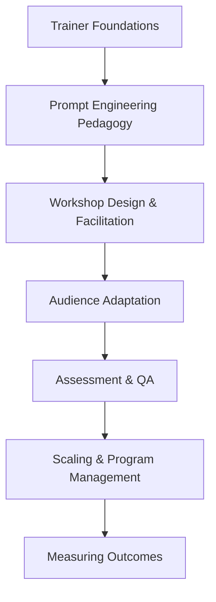

# Claude Train-the-Trainer

**Enabling AI Champions to Teach Claude Effectively at Scale**

---

## Overview

Claude Train-the-Trainer is a comprehensive enablement system designed to equip trainers, facilitators, and internal champions with everything they need to deliver high-quality Claude training programs across their organizations. Rather than training end users directly, this system trains the *trainers* — creating a scalable multiplier effect that accelerates Claude adoption while maintaining consistency and quality.

The system provides modular workshop designs, audience adaptation frameworks, assessment tools, and quality assurance processes that enable training teams to confidently deliver Claude education to diverse audiences — from technical developers to non-technical business users.

## Who This Is For

- **Enterprise Training Teams** — L&D professionals responsible for rolling out Claude across large organizations
- **Partner Champions** — Channel partners and consultants who deliver Claude training to their clients
- **Internal Enablement Leaders** — Department leads and power users tasked with driving adoption within their teams
- **Training Program Architects** — Instructional designers building structured Claude curricula from scratch

## How to Use This System

This system is structured as a progressive learning path:

1. **Start with the [Course Description](course-description.md)** to understand the full scope, prerequisites, and learning outcomes
2. **Work through the chapters sequentially** — each builds on the previous, moving from foundational knowledge through workshop design to program management
3. **Use the workshop templates and assessment tools** as starting points — adapt them to your specific audience and organizational context
4. **Apply the quality assurance frameworks** to maintain training consistency as you scale your program

!!! tip "Modular by Design"
    Every chapter and workshop template is designed to stand alone. While the full sequence provides the deepest value, you can pull individual modules for targeted enablement needs.

## System Architecture

## Core Principles

- **Train the multiplier, not the end user** — One well-equipped trainer reaches hundreds of learners
- **Audience-first design** — The same Claude capability requires different framing for different roles
- **Quality at scale** — Consistency frameworks prevent training drift as programs grow
- **Measurable impact** — Every training program should produce evidence of learner competency gains
